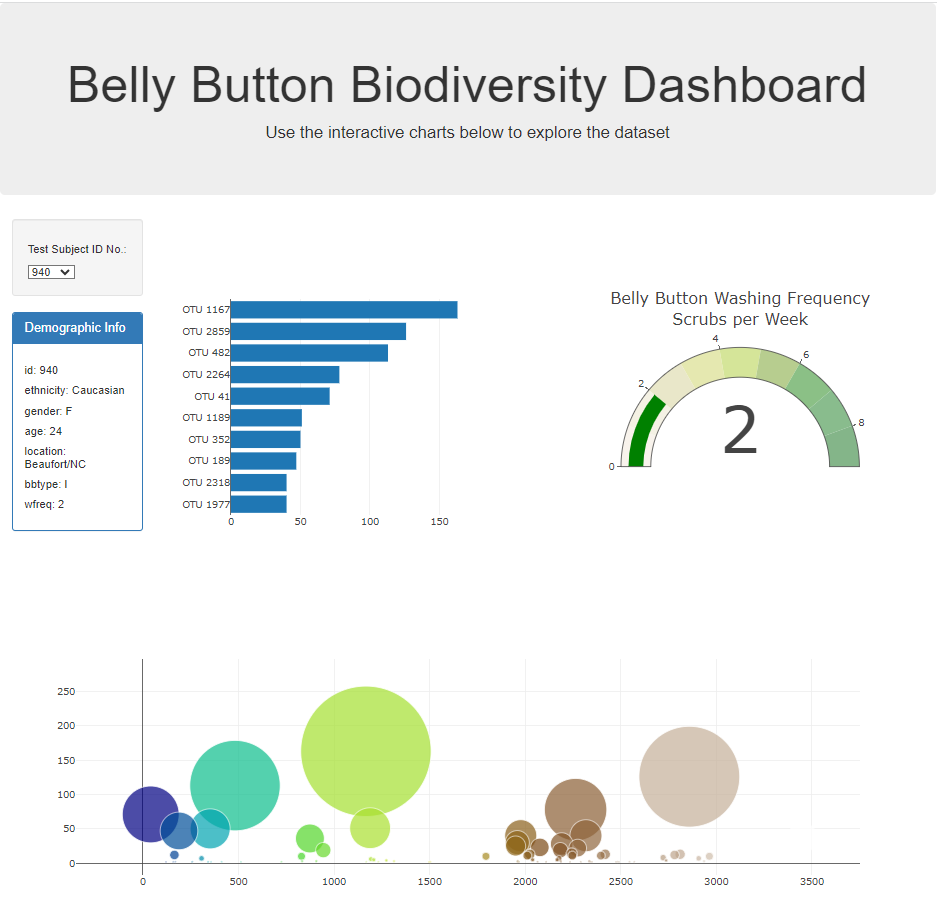

# MOD14-Belly-Button-Challenge
Student:  Jennifer Grubb  
Instructor:  Steven Greene  
Bootcamp:  DU-VIRT-DATA-PT-06-2023  
05 November 2023  

## Table of Contents
- [About](#about)
- [Contributing](#contributing)
- [Summary](#summary)
  
## About
In this challenge, I built an interactive dashboard to explore the Belly Button Biodiversity dataset, which catalogs the microbes that colonize human navels. The dataset reveals that a small handful of microbial species (also called operational taxonomic units, or OTUs, in the study) were present in more than 70% of people, while the rest were relatively rare.  

## Contributing
N/A

## Summary

